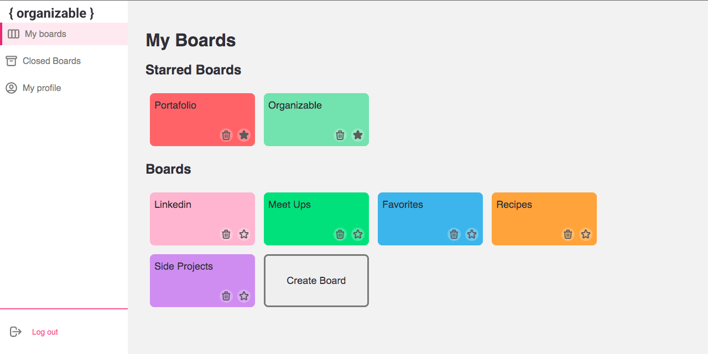
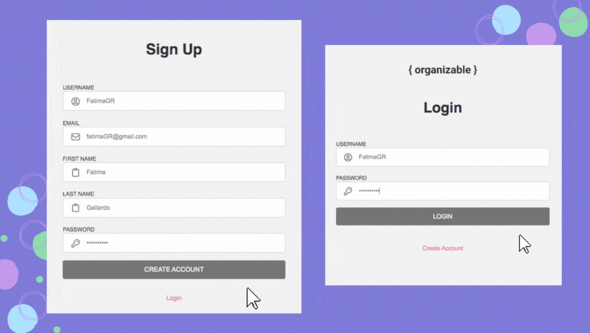
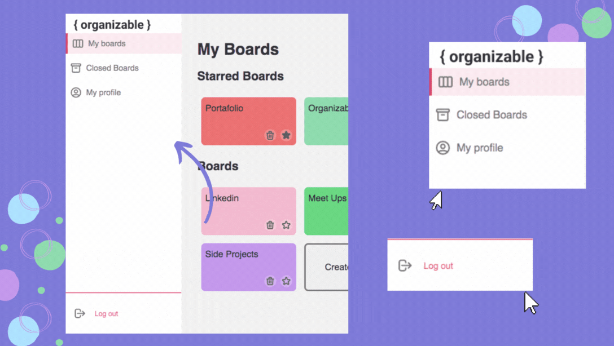
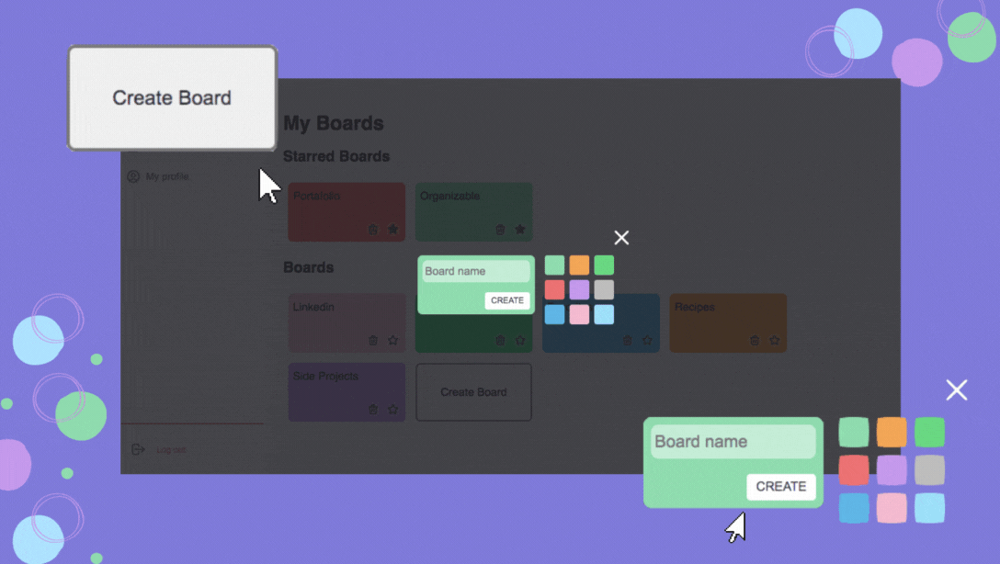
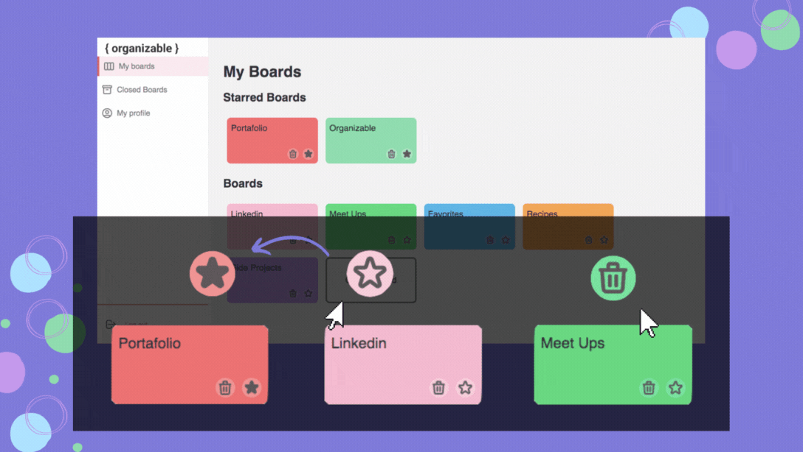
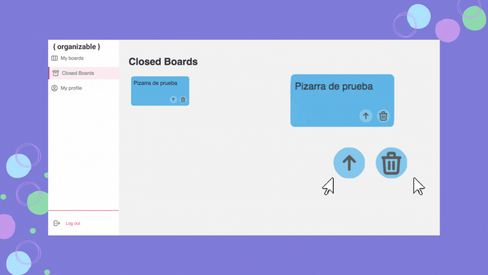
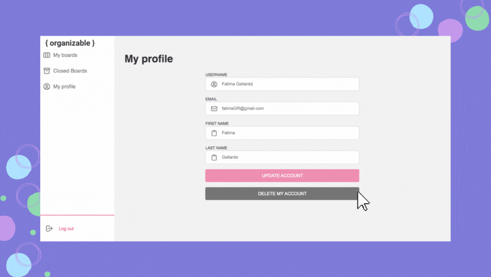
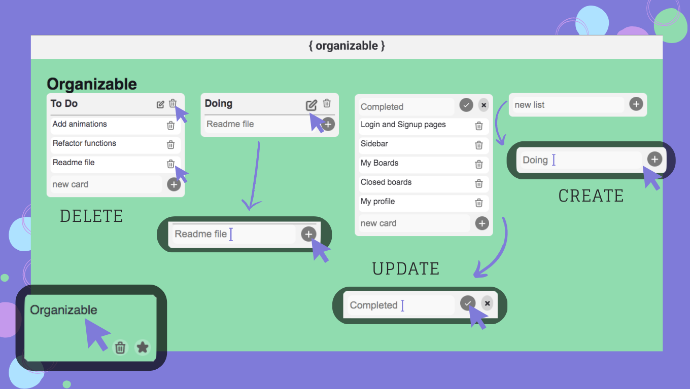

# Organizable

An application to keep track of all your projects.

## Table of contents

- [Getting Started](#getting-started)
  - [Built with](#built-with)
  - [Installation](#installation)
- [Overview](#overview)
  - [Screenshot](#screenshot)
  - [Links](#links)
- [How to use](#how-to-use)
  - [User account](#user-account)
  - [Home](#home)
  - [My boards](#my-boards)
  - [Closed boards](#closed-boards)
  - [My profile](#my-profile)
  - [Lists](#lists)

## Getting Started
### Built with


- JavaScript
- React
- Emotion
### Installation
Run the following commands:
```
npm install
```
Running the app
```
npm start
```
To view it open http://localhost:3000

## Overview
### Screenshot


### Links
- Live Site URL:[Organizable](https://organizable-kohl.vercel.app)

## How to use
### User account
To use Organizable you need an account. First you will see the "Login" page, if you don't have an account, you can create one in the "Sign Up" page.



### Home
After you login, you will see Organizable's home page, it have a sidebar that contains "My Boards", "Closed Boards" and "My profile" pages, and the option to Log Out.


### My Boards
In this page you can create, starred and close boards.

To create board click the button with the same name, it open a modal where you can fill Board details like color and title.



To starred a board click on its star, and to close it click on its trash.



### Closed Boards
In this page you can recover or delete permanently a board.

To recover a board click on its arrow up, and to delete permanently it click on its trash. 


### My profile
In this page you can see, edit and delete your profile.

To edit your profile, update your information and click the "Update Account" button.

To delete your profile click the "Delete my Account" button.


### Lists
When you click a board you will open its page, it have the options to create, update and delete lists with cards.

To create a list fill a title and click "+" button.

To delete a list click the trash button.

To edit a list click the edit button, then an editable input will be displayed.

To create or delete a card do the same with their respective buttons

